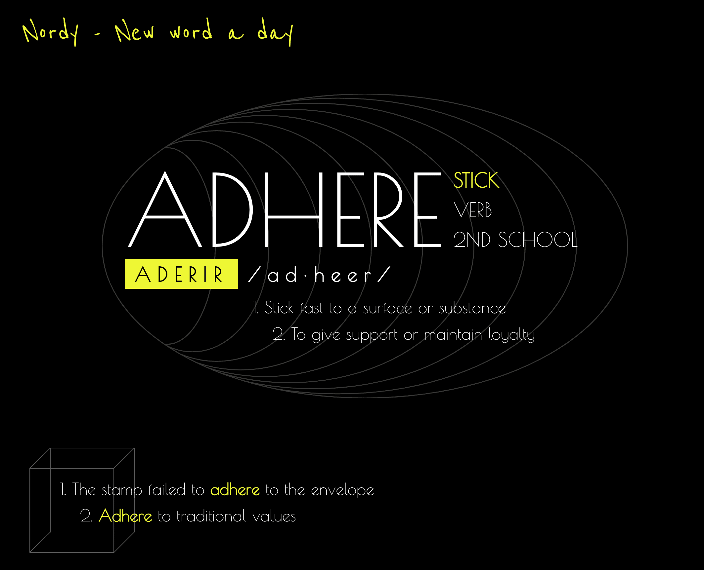

<p align="center">
  
</p>

# Nordy

Nordy is a dictionary with the words and their meanings that I learn on a daily basis.

Available in: https://nordy.vercel.app/

## Getting Started

Clone the repo, enter in the nordy folder and install the dependencies:

```
cd nordy
yarn install
```

### Development

Run the development server:

```
yarn dev
```

Open [http://localhost:3000](http://localhost:3000) with your browser to see the initial page.

### Production

If you like to try the production build, run:

```
yarn build
```

And then:

```
yarn preview
```

## Commands

- `dev`: runs your application on `localhost:3000`
- `build`: creates the production build version
- `preview`: starts a simple server with the build production code
- `test`: runs vitest in watch mode
- `test:coverage`: runs vitest returning coverage table
- `test:ci`: runs vitest once in CI
- `lint`: runs the linter in all components and pages
- `format`: runs prettier to format all components and pages
- `typecheck`: runs the type checker in all components and pages
- `storybook`: runs storybook on `localhost:6006`
- `storybook:build`: create the build version of storybook
- `generate`: runs plop to generate component files

## Todo

- [ ] Stories

## Features

- [x] Meaning
- [x] Examples
- [x] Pronunciation
- [x] Grade level
- [x] Category by first letter
- [ ] Word type: slang, acronym
- [ ] Expressions
- [ ] Refactor data files / database
- [ ] Calendar selection
- [ ] Search by date
- [ ] Search by type
- [ ] Send to email
- [ ] Favorite
- [ ] Quiz with synonym options 

---

Made with ♥️ by Frederico Vieira
